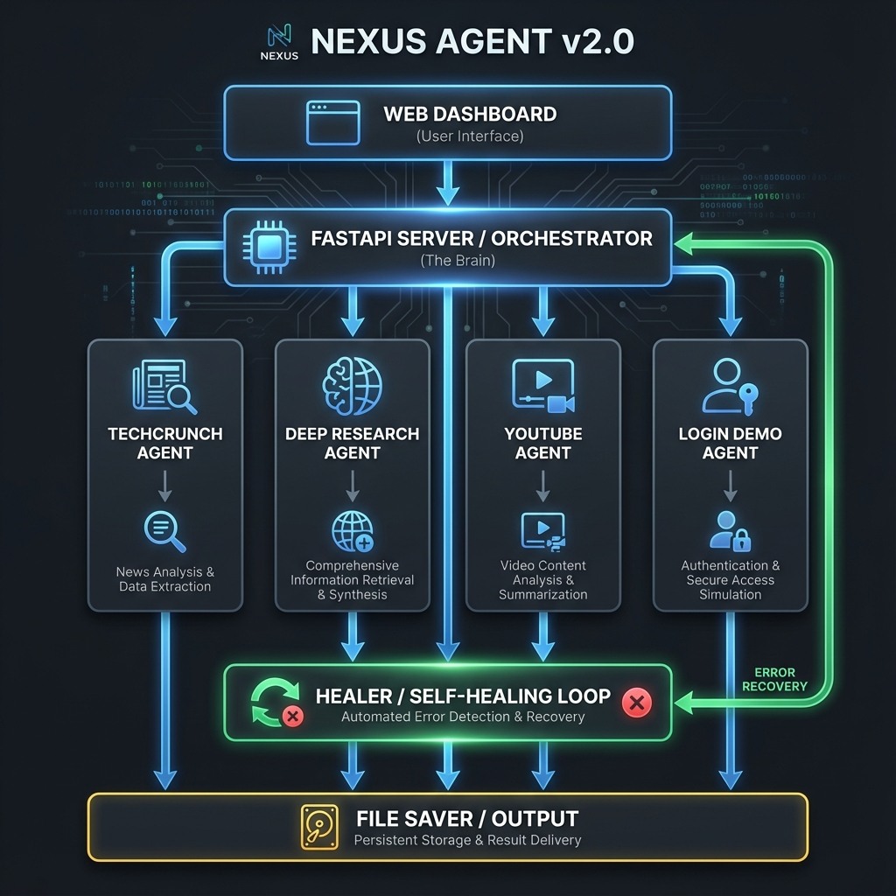

# NEXUS AGENT v1.0 - Autonomous Browser Intelligence Suite

**Nexus Agent** is an autonomous browser intelligence suite designed to perform complex web tasks without human intervention. It combines advanced LLMs with headless browser automation to read news, research topics, and even control media playback.

The system is designed with a **Self-Healing Architecture**, meaning it can detect failures in one agent and intelligently reroute the workflow to an alternative path (e.g., Switching to Search if Scraping fails).



---

## 🚀 Key Features

*   **🕵️ Topic Research**: Performs deep web research using Tavily API, consolidates findings, and writes professional articles. Includes a "Live Visual Demo" mode.
*   **🤖 Auto-TechCrunch**: Autonomously browses TechCrunch, finds random AI news, and converts it into a blog post.
*   **▶️ YouTube DJ**: A fully autonomous media agent that handles logins/cookies, searches for videos, and plays them.
*   **🔐 Login Demo**: Demonstrates secure automated authentication on SauceDemo with custom credentials.
*   **🚑 Self-Healing (Disaster Recovery)**: An intelligent "Healer" agent that intercepts errors (timeouts, API limits) and reroutes the workflow to alternative paths to ensure task completion.
*   **✨ Cyberpunk UI**: A modern, animated interface with glassmorphism and real-time status updates.

---

## 🛠️ System Architecture

### 1. High-Level Design (LangGraph)
The system follows a **Multi-Agent Orchestration** architecture powered by **LangGraph**. It treats the workflow as a state machine, where data is passed between specialized "Nodes" (Agents).

### 2. Core Components

#### A. The Brain (Orchestrator)
*   **LangGraph**: Manages the state (context) of the execution. It decides which agent runs next and passes data (like `html_content`, `research_context`, `draft_blog`) between them.
*   **Healer Node (Disaster Recovery)**: A specialized node that acts as a middleware. If any agent returns an `error` state, the Healer intercepts it, analyzes the error, and decides on a "Patch" (Retry, Reroute, or Fail).

#### B. The Agents (Workers)
1.  **Navigator Agent**: Uses Playwright to browse TechCrunch. Includes random article selection logic.
2.  **Research Agent**: Uses Tavily API + Visual Playwright Demo to research topics.
3.  **YouTube Agent**: Manages persistent browser sessions for media playback.
4.  **AutoLogin Agent**: Demonstrates secure form filling and authentication on SauceDemo.
5.  **Healer Agent**: The "Doctor" that prescribes fixes for workflow interruptions.

#### C. The Interface
*   **Web UI**: A Cyberpunk-themed interface with real-time status logging and animated backgrounds.
*   **FastAPI**: Handles concurrent requests using thread pools to ensure browser actions don't block the server.

---

## 🔄 Workflows & Failure Modes

### Standard Flow
`Router` -> `Selected Agent` -> `Extractor/Action` -> `Generator` -> `Reviewer` -> `Saver`

### Self-Healing Flow (Example)
1.  **Start**: User selects "Auto-TechCrunch".
2.  **Failure**: Navigator Agent fails with `TimeoutError` (Site down).
3.  **Interception**: `Healer Node` catches the error.
4.  **Decision**: Healer decides to "Reroute to Research Mode".
5.  **Recovery**: Workflow jumps to `Research Agent` -> `Generator`.
6.  **Result**: User gets a blog post about TechCrunch news (from search) instead of a crash.

---

## 💻 Tech Stack

*   **Logic**: Python 3.10+, LangGraph
*   **Browser**: Playwright (Chromium)
*   **AI**: OpenAI GPT-4o, Tavily Search
*   **Web**: FastAPI, TailwindCSS, HTML5 w/ Glassmorphism

---

## 🚦 Getting Started

### 1. Installation
```bash
# Install dependencies
pip install -r requirements.txt

# Install Playwright browsers
playwright install chromium
```

### 2. Configuration
Create a `.env` file with your API keys:
```env
OPENAI_API_KEY=sk-...
TAVILY_API_KEY=tvly-...
```

### 3. Running the Agent
Start the FastAPI server:
```bash
python server.py
```

### 4. Usage
Open your browser to `http://localhost:8000` to access the Cyberpunk Dashboard.
*   **Research**: Enter a topic to get a deep-dive article.
*   **TechCrunch**: One-click autonomous news blogging.
*   **YouTube**: Auto-play any video.
*   **Login Demo**: Test the auth agent.

---

## 📄 License
MIT
